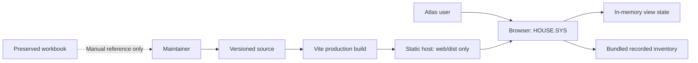
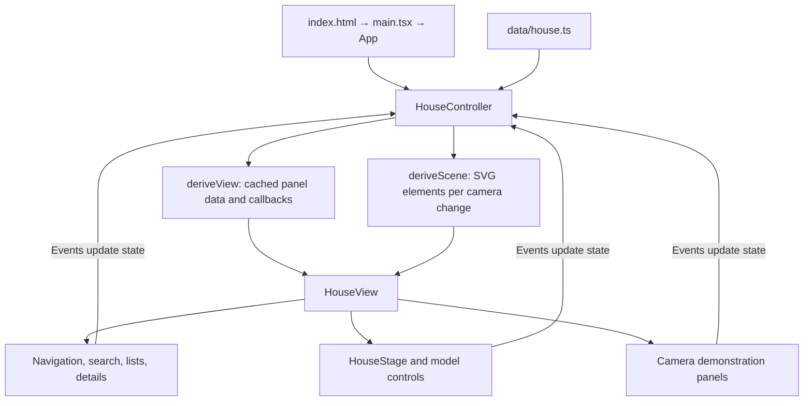

# Architecture

SmartHome separates home subsystems by ownership while sharing repository-level
tooling. The static house atlas lives in `home-docs/apps/web/`. A separate local
camera prototype in `security/apps/camera-viewer/` adds a localhost Node server,
renewable account access, optional ADB session import, and browser WebRTC playback. There is no shared database or
cross-repository runtime dependency. See [its decision](decisions/0003-local-camera-prototype.md)
for the authentication boundary and live-validation requirements. The local server
also serves the atlas at `/house/`; Security opens the player in a same-origin
dialog. [Decision 0004](decisions/0004-security-live-camera-integration.md) defines
this runtime integration. Standalone static atlas hosting remains supported.
[Decision 0005](decisions/0005-renewable-camera-account.md) adds Windows-encrypted
account persistence and automatic credential renewal; live account validation is
tracked in the camera service guide.

## System context

The workbook is not parsed at runtime or build time. The browser receives
inventory through the JavaScript bundle. Recorded camera statuses and generated
event demonstrations do not establish a connection to a camera.

## Repository boundaries

| Boundary        | Owns                                                                | Does not provide                                    |
| --------------- | ------------------------------------------------------------------- | --------------------------------------------------- |
| Root            | pnpm workspace, lockfile, common lint/format tools, CI, shared docs | Application state or a shared runtime service       |
| `home-docs/`    | Web app, inventory, geometry, app tests, source references          | Live automation or editing backend                  |
| `security/`     | Local camera playback and renewable account session                 | Remote hosting or camera recording                  |
| `platforms/`    | Reserved location for platform configurations                       | Installed Home Assistant or other running platforms |
| `docs/archive/` | Preserved pre-migration source                                      | Maintained production code                          |

KumarSec and FamSecDash remain separate repositories. Root workspace discovery
includes `home-docs/apps/*` and `security/apps/*`. A shared toolchain change can affect
all workspace packages. Integrated Security hosting requires both app builds.

## Browser execution

[main.tsx](../home-docs/apps/web/src/main.tsx) loads bundled font styles and
global CSS, creates a React root in Strict Mode, and mounts
[App](../home-docs/apps/web/src/app.tsx).

[HouseController](../home-docs/apps/web/src/features/house/house-controller.jsx)
owns selections, mode filters, search, isolation, panel visibility, model
orientation, animation state, and the URL-hash view. `deriveView()` derives the
panel view object (cached until a non-camera state key changes) and
`deriveScene()` projects the SVG; native React components consume both through
[HouseView](../home-docs/apps/web/src/features/house/house-view.jsx), whose
panels are memoised on the view reference.

The controller still contains overview copy and camera-history generation;
sound zones, room aliases, the glossary, circuit-reference resolution, and
related-record lookups live in
[catalog.ts](../home-docs/apps/web/src/features/house/catalog.ts). Inventory is
extracted, but domain/presentation separation is not complete. See the
[web app reference](../home-docs/apps/web/README.md) before changing those paths.

## Geometry and interaction

[renderScene](../home-docs/apps/web/src/features/house/scene.jsx) projects room
polygons into an SVG coordinate space that matches the stage in CSS pixels,
fitting the model to the area left free by the side panels. It applies floor
elevation, separation, room offsets, yaw, pitch, zoom, and pan; sorts visible
faces by depth; and adds overlays for the selected documentation mode.

Room isolation filters scene geometry. Inventory lists have their own mode
filters, so isolating the scene does not imply a global data filter. Room
coordinates and coverage ranges are model units, not a measured survey.

Pointer events rotate or pan the stage; a non-passive wheel listener controls
zoom. Animation frames drive automatic rotation and floor separation. The
controller removes its wheel/resize listeners, interval, and animation frames
on unmount. UI state lives in memory and resets on page reload.

## Build, test, and delivery boundaries

React and fonts are package dependencies bundled by Vite. There is no runtime
CDN, DC interpreter, or browser compilation in the active app.
`pnpm build` produces `home-docs/apps/web/dist/`.

Unit tests read the archived prototype as a trusted local migration baseline.
That Node-only test evaluation is separate from the browser application.
The archive is neither an entry point nor a public asset. Browser tests run the
production output through local preview; see [testing](testing.md).

The app has a single URL with in-memory mode changes and no history-router
fallback requirement. No deployment provider or automatic deployment is configured.
Hosting and access control are operator responsibilities; see
[deployment](deployment.md) and [security](security.md).

## Design choices and remaining constraints

[ADR-0001](decisions/0001-monorepo-of-subsystems.md) establishes subsystem
ownership. [ADR-0002](decisions/0002-native-react-workspace.md) adds the native
React build and shared pnpm tooling without introducing runtime coupling.

TypeScript is strict for TS/TSX sources; existing JSX is permitted with
`checkJs: false`. The controller and renderer remain substantial migration code.
Their current shape is preserved behavior, not a recommended template for a new
feature. [Known limitations](limitations.md) describes the implications.

## Adding a subsystem or integration

1. Establish the concrete use case, ownership, and data boundary in an ADR when
   the change creates runtime coupling or a significant architectural obligation.
2. Add the subsystem directory, or `platforms/<name>/` for supporting
   infrastructure, with a README covering status, setup, configuration,
   verification, operations, and rollback.
3. Keep code and tests within that boundary. Add workspace discovery only for
   real packages; make root commands and CI cover them deliberately.
4. Define authentication, secret handling, data retention, failure behavior, and
   deployment before adding a live service. Do not reuse demonstration labels as
   evidence of an operational connection.
5. Update the root map, [documentation index](README.md), relevant guides,
   and [changelog](../CHANGELOG.md).

Shared packages are justified by demonstrated reuse. A task orchestrator,
database, and server framework are not prerequisites for the current static app.
