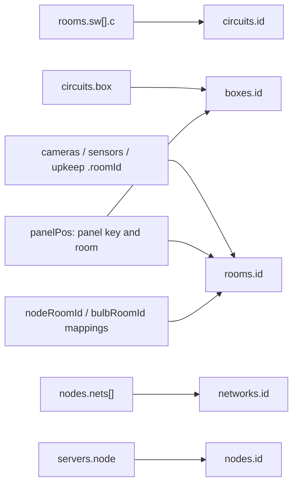

# House data model and editing

The active data source is
[apps/web/src/data/house.ts](../apps/web/src/data/house.ts). It exports recorded
inventory and floor geometry imported by the controller. The
[source workbook](../reference/README.md) is preserved reference material and is
not automatically imported or synchronized.

## Provenance and authority

| Material                           | Role                                                                  | Maintenance rule                        |
| ---------------------------------- | --------------------------------------------------------------------- | --------------------------------------- |
| `src/data/house.ts`                | Runtime inventory and geometry                                        | Change through a reviewed source update |
| `house-controller.jsx`             | Derived views plus remaining sound/overview content and room mappings | Check alongside inventory changes       |
| `reference/house-inventory.xlsx`   | Original workbook, moved from `Book1.xlsx`                            | Preserve its contents                   |
| `docs/archive/home-documentation/` | Original prototype and migration baseline                             | Immutable; never edit to satisfy tests  |
| Git diff and tests                 | Evidence of an intentional model change                               | Keep the reviewed data delta explicit   |

The app's data was extracted from the prototype. The workbook is historical
reference, not proof of a complete import or agreement with every runtime field.
Migration parity establishes preservation, not current physical accuracy.

## Runtime exports

Counts below describe the checked-in inventory reviewed on **2026-09-12**.
They count records, not necessarily physical devices; a bulb record may describe
multiple fixtures.

| Export        | Records | Fields and purpose                                                                                                  |
| ------------- | ------- | ------------------------------------------------------------------------------------------------------------------- |
| `boxes`       | 2       | `id`, `name`, `short`, `size`, `loc`, `total`: panel metadata                                                       |
| `circuits`    | 24      | `id`, `box`, `no`, `amp`, `type`, `label`: circuit descriptions                                                     |
| `rooms`       | 21      | `id`, `name`, `short`, `floor`, `height`, `verts`, optional `sw`: geometry and circuit links                        |
| `bulbs`       | 18      | `id`, `room`, `fixture`, `base`, `w`, `lm`, `k`, `brand`, `model`, `replaced`, `life`, `smart`, `st`                |
| `networks`    | 3       | `id`, `name`, `ssid`, `band`, `color`: documented network identities                                                |
| `nodes`       | 6       | `id`, `name`, `role`, `room`, `model`, `backhaul`, `plug`, `nets`, `status`                                         |
| `servers`     | 3       | `id`, `name`, `kind`, `room`, `node`, `power`: server records and node associations                                 |
| `cameras`     | 8       | Identity, room/floor, position, orientation/coverage, specifications, recording/storage descriptions, status, power |
| `sensors`     | 7       | `id`, `name`, `roomId`, `mount`, `target`, `status`: planned climate sensors                                        |
| `upkeep`      | 7       | `id`, `kind`, `device`, `roomId`, `metric`, `used`, `life`, `lastDone`, `part`, `status`, `note`                    |
| `floorLabels` | 3 keys  | Labels for `basement`, `main`, and `second`                                                                         |
| `panelPos`    | 2 keys  | Panel ID → `x`, `y`, `floor`, and room ID in `room`                                                                 |
| `nodeRoomId`  | 6 keys  | Display room name → geometry room ID                                                                                |

Exported types `Room`, `Camera`, and `Circuit` are inferred from the arrays.
`Floor` is the key union of `floorLabels`. These are not a runtime validation
schema; new malformed relationships can compile unless explicitly constrained.

## Relationships

IDs must stay unique within a collection and stable across references. A room
rename is not just a label edit if a device joins by display name.

Some links use display strings rather than foreign-key fields:

- Node placement uses `nodeRoomId[node.room]`.
- Bulb placement uses the controller's `bulbRoomId(bulb.room)` mapping.
- Circuit and power descriptions such as `plug` or `power` contain display text,
  not fully parsed relationships.
- Sound-zone room IDs and layout definitions live in the controller.

When changing a room, node, or circuit ID, inspect both
[house-controller.jsx](../apps/web/src/features/house/house-controller.jsx) and
[scene.jsx](../apps/web/src/features/house/scene.jsx) for references.

## Coordinates and units

Rooms use `verts: [x, y][]` polygons, `height`, and one of the three floor keys.
Vertices are model coordinates in a shared floor plane. The renderer derives
floor elevations and projects the model into a `960 × 600` SVG viewBox.
Coordinates are not documented as feet or meters; do not convert them on assumption.

Preserve polygon order and finite coordinates. The renderer uses polygon
winding to determine wall visibility. Tests require at least three vertices,
but do not detect self-intersections, overlapping rooms, invalid physical scale,
or all floor-key errors.

Camera records use `pos: [x, y]`, `floor`, `roomId`, `facing`, `fov`,
and `range`. Angles are degrees; the controller's compass mapping uses 0° east,
90° south, 180° west, and 270° north. Coverage range is in model units and is
illustrative. Specification fields are `res`, `night`, `mic`, `rec`,
`store`, `status`, and `power`.

Panel capacity/size text and `total` should not be confused with the number of
circuit records. Circuit `no` is the documented breaker position, `amp` its
recorded amperage, and `box` its panel ID.

Bulb `w`, `lm`, and `k` represent watts, lumens, and kelvin; `life` is
displayed as years. Upkeep `metric` supplies the unit for `used` and `life`
(for example hours or months). Date-like values are recorded display strings,
not live scheduling inputs.

## Status semantics

| Field                         | Current interpretation                                         |
| ----------------------------- | -------------------------------------------------------------- |
| Bulb `st` and upkeep `status` | Recorded `ok`, `soon`, or `overdue` indicators                 |
| Node `status`                 | Recorded condition; the controller maps `warn` to WEAK         |
| Camera `status`               | Stored online/offline state used by demonstration presentation |
| Sensor `status`               | All current records are `planned`                              |

Do not infer freshness, notifications, or a real hardware check from these fields.
Maintenance status is stored explicitly rather than recomputed from today's date.
Preserve unknown hardware descriptions as unknown until a source is verified.

## Intentional inventory changes

1. Identify the correction and its source with the repository owner. Record the
   intended before/after values in the review; avoid duplicating private details
   into public artifacts.
2. Inspect the affected records, IDs, geometry, and name-based mappings. Use
   `rg` to find references in both the data and feature directory.
3. Edit the active source only. Preserve the archive and workbook contents.
4. Account for the migration parity test in
   [house.test.ts](../apps/web/src/data/house.test.ts). It currently compares every
   runtime export to the original prototype, so an intentional data change will
   fail exact parity.
5. In that same reviewed change, transition the active-data expectation to an
   explicitly reviewed fixture representing the new inventory, retaining
   relationship checks. Keep the historical baseline/provenance available.
   Do not blindly regenerate expected values from the changed implementation,
   skip the test, or edit historical input.
6. Add checks for relationships affected by the update. Existing integrity
   tests do not cover every mapping; see [testing](../../docs/testing.md).
7. Run formatting, typecheck, lint, unit tests, production build, and browser
   tests through the [required root gates](../../docs/testing.md#required-local-gates).
   Inspect the affected mode, search result, and scene on desktop and narrow layouts.
8. Update this guide if counts or semantics changed, and add a changelog entry.

There is no import script or data migration service today. Adding one is a
separate design change, not an implied part of editing a record.
